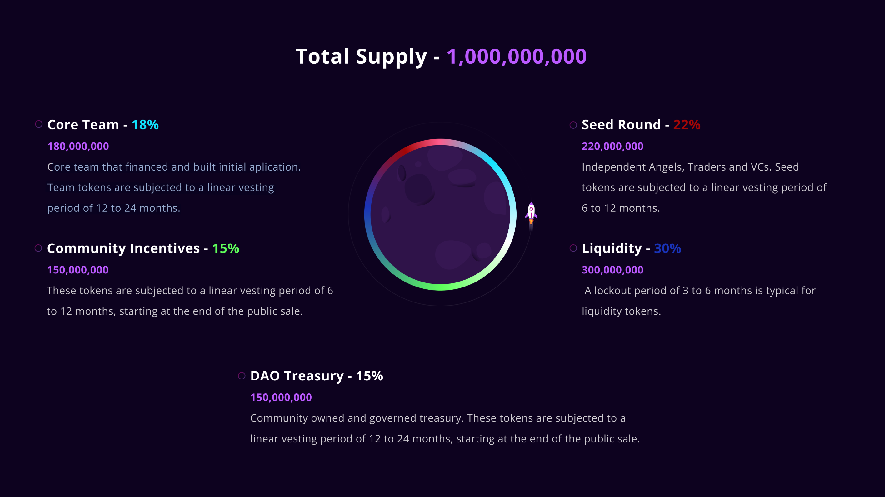

import { HeroPattern } from '@/components/HeroPattern'

export const description = 'Tokenomics'

<HeroPattern />

# Tokenomics

|              |               |
| ------------ | ------------- |
| Name         | SLDX          |
| Ticker       | $SLDX         |
| Supply       | 1,000,000,000 |
| Type         | Utility       |
| Availability | Solana        |
|              |               |

SLDX is the native token of the SLDX platform, with a hard capped supply of 1B units, set to exhibit deflationary properties over time. SLDX is designed as a utility token that services many key functions within the network. SLDX is currently available on the following blockchains:
| Blockchain | Contract|
| ------------ | ------------- |
| Solana | ------------- |

## Token Functionality

- Slide Trade platform
- Poker
- Battle area

## Distribution

| Entity               | Percentage | Amount      | Description                                                                                                                                          |
| -------------------- | ---------- | ----------- | ---------------------------------------------------------------------------------------------------------------------------------------------------- |
| Seed Round           | 22%        | 220,000,000 | Independant Angels, Traders and VCs. Seed tokens are subjected to a linear vesting period of 6 to 12 months.                                         |
| Liquidty             | 30%        | 300,000,000 | A lockout period of 3 to 6 months is typical for liquidity tokens.                                                                                   |
| Core Team            | 18%        | 180,000,000 | Core team that financed and built the initial applications. Team tokens are subjected to a linear vesting period of 12 to 24 months.                 |
| Community Incentives | 15%        | 150,000,000 | These tokens are subjected to a linear vesting period of 6 to 12 months, starting at the end of the public sale.                                     |
| SLDX DAO Treasury    | 15%        | 150,000,000 | Community owned and governed treasury. These tokens are subjected to a linear vesting period of 12 to 24 months, starting at the end of public sale. |
